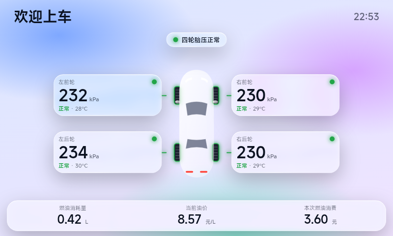

# CarLink Lab

Android 手机端车辆互联与 TPMS 仪表实验项目，重点面向 2015/2016 Hyundai Tucson TL 1.6T G4FJ 与支持百度 CarLife 的现代/起亚车机。

> 这是一个面向自有车辆、互操作研究和停车调试的实验项目。它不是百度官方 CarLife 客户端，也无法把 Android 手机合法地伪装成 Apple CarPlay 设备。

## 功能

- Android 前台服务维持 CarLife TCP 通道和 WiFi ELM327 连接。
- 在手机与 CarLife 车机之间建立本地 TCP 通道，发送 H.264 仪表画面。
- 通过 WiFi ELM327 轮询 Hyundai Mode 21 TPMS 数据。
- 读取标准 OBD-II 燃油流量 PID，计算本次消耗量、油价和本次消费。
- 使用 HTML/CSS/SVG 渲染液态玻璃仪表，并通过 WebView 转为视频帧。
- 支持自定义欢迎标题、油价省份和汽油标号。
- TPMS 缺失数据显示 N/A；胎压按正常、偏高偏低、过低显示不同颜色。

## 已验证环境

- 车辆：2015/2016 Hyundai Tucson TL 1.6T G4FJ
- 车机：原生支持 CarLife 的 800x480 车机
- OBD：WiFi ELM327
- 手机：Android 8.0 及以上
- TPMS 请求：请求头 7D6，请求 21 06，响应 61 06

不同市场、年款、车机固件和适配器可能使用不同端口、CAN 地址或数据布局。请先保存原始日志，再修改协议代码。

## 快速开始

### 构建

要求 JDK 17 和 Android SDK Platform 35。

~~~powershell
.\gradlew.bat assembleDebug
~~~

Windows 也可以运行：

~~~powershell
.\scripts\build-debug.ps1 -Offline
~~~

APK 输出：

~~~text
app\build\outputs\apk\debug\app-debug.apk
~~~

### 使用

1. 手机连接 WiFi ELM327。
2. 打开 CarLink Lab，进入 CarLife 客户端页面。
3. 设置欢迎标题、油价省份、汽油标号、ELM327 IP 和端口。
4. 点击“开始”，确认前台服务通知出现。
5. 在手机开发者选项中启用 USB 调试。
6. 通过 USB 连接车机并启动车机端 CarLife。
7. 停车状态下确认 TPMS、燃油和视频画面。

## 数据流

~~~text
WiFi ELM327 -- OBD/TPMS --> TucsonTpmsDataSource
                                  |
                                  v
                         TpmsSnapshot
                                  |
CarLife head unit <-- H.264 <-- H264FrameEncoder
                                  ^
                                  |
                      WebViewDashboardRenderer
                                  ^
                                  |
                  app/src/main/assets/tpms_template.html
~~~

详细说明见 [docs/ARCHITECTURE.md](docs/ARCHITECTURE.md)。

## TPMS 与燃油

本项目当前针对目标车辆使用：

- 压力：rawPressure / 4 * 6.894757 kPa
- 温度：rawTemperature - 40 摄氏度
- 轮位：记录 1-4 对应左前、右前、左后、右后
- 燃油：优先 015E；不可用时用 0110 MAF 与 010D 车速计算
- 油价默认使用第三方接口，可在设置中更换省份和汽油标号

第三方油价接口可能随时变更或不可用，项目不保证其持续工作。

## 隐私

- 不包含遥测、账号系统或广告 SDK。
- 不主动上传车辆数据。
- 运行时会访问用户配置的 ELM327 地址和第三方油价接口。
- 提交 Issue 前请删除日志中的 VIN、位置、手机号、IP、车牌和账号信息。
- 不要把签名密钥、token、密码或原始私有日志提交到 Git。

## 法律与安全

- 与 Baidu、Apple、Hyundai、Kia 或其关联公司无隶属或授权关系。
- CarLife、CarPlay、Hyundai、Kia 等名称和商标归各自权利人所有。
- 本项目不包含第三方固件、官方客户端代码或认证芯片绕过方案。
- 协议逆向仅用于互操作研究和用户自有车辆。
- 使用者需自行确认当地法律、车辆保修条款和第三方服务条款。
- 禁止在驾驶过程中操作手机或调试界面。
- 不得将本项目用于未授权车辆、绕过安全认证或破坏车辆系统。

完整说明见 [docs/LEGAL.md](docs/LEGAL.md)。

## 参与开发

请先阅读 [CONTRIBUTING.md](CONTRIBUTING.md)、[SECURITY.md](SECURITY.md) 和 [CODE_OF_CONDUCT.md](CODE_OF_CONDUCT.md)。

提交协议适配时，请提供可复现步骤和数据来源，不要提交 VIN 或其他隐私信息。发布前检查 [docs/OPEN_SOURCE_CHECKLIST.md](docs/OPEN_SOURCE_CHECKLIST.md)。

## 许可证

MIT License，见 [LICENSE](LICENSE)。第三方依赖和商标不适用 MIT License。
